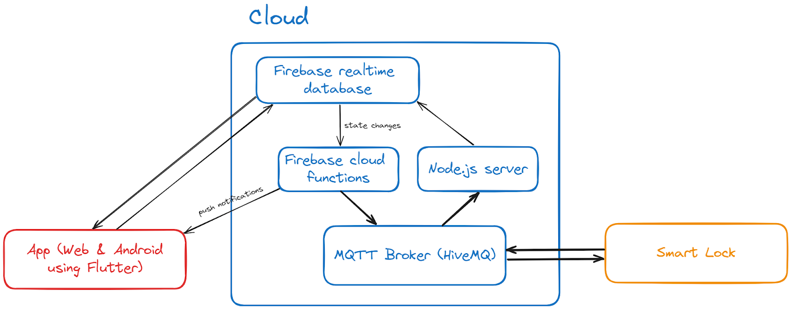

# LockSense

LockSense is a smart lock that you can manage on the cloud.

This is a course requirement for the CS 145 Computer Networks Course of the Department of Computer Science, College of Engineering, University of the Philippines, Diliman for A.Y. 2023-2024.

- Albarracin, Francis
- Alvarado, Enrique Luis
- Antonio, Harold
- Askin, Josh Alec
- Beltran, Emmanuel II
- Orfiano, Zachary Claude

## Architecture

